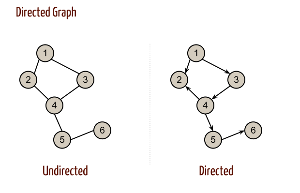

# Objectives

* Learn how to represent knowledge using Graph as data structure
* Homework 1 discussion

# Metrics/Desired Outcomes

* Understanding Graph Theory
* Programming Graph
* Reading/writing Graph from/to file
* Basic graph traversal (overview)
* Complexity analysis (space and/or time)

# Knowledge Representation

## Information

### Important Announcement

Since we just got our discount from Github for private repositories, I will be closing all your exercise repositories and have you to click on another link to create private homework repository.

#### Graph Components

* Node (Usually called Vertex)
* Edge
* Graph

#### Methods

* Adjacent
* Neighbors

### Examples

* Social network
* Map/city (locations)
* Game States

### Types of Graphs

* Directed/Undirected 
* Weighted
* Dense/Sparse

> Dense graph: graph has a lot more edges than vertices (usually defined as `|E| = O(|V|)` where |E| is number of edges and |V| is number of vercices)  
> Sparse graph: graph has relative fewer edges than vertices (usually defined as `|E| = Θ(|V^2|)`)

### Graph as Abstract Data Structure

#### 3 ways to represent graph in programming

1. Adjacency Matrix
2. Adjacency List
3. Object Oriented (objects and pointers)

> With the complexity analysis below, be sure to know pros and cons for each one

#### Complexity Analysis

  | Adjacency List | Adjacency Matrix | Object Oriented
-- | -- | -- | --
Store graph | O(&#124;V&#124; + &#124;E&#124;) | O(&#124;V&#124;2) | Depends
Add vertex | O(1)| O(&#124;V&#124;2) | Depends
Add edge | O(1) | O(1) | Depends
Remove vertex | O(&#124;E&#124;) | O(&#124;V&#124;2) | Depends
Remove edge | O(&#124;E&#124;) | O(1) | Depends
Query | O(&#124;V&#124;) | O(1) | Depends
Remarks | Slow to remove vertices and edges, because it needs to find all vertices or edges | Slow to add or remove vertices, because matrix must be re-sized/copied | Readable and convenient for OOP(Object Oriented Programming) background users

Reference: [Wikipedia - Abstract data structure][wiki-graph]

### Graph Traversal Algorithms Overview

* **Breadth First Search** (BFS)
* **Depth First Search** (DFS)
* A-star
* Dijkstra
* Alpha-beta
* Min-max

## Learning

### [Design Pattern][design-pattern] in action

* Strategy pattern (Representation interface)
* Factory pattern (again Representation interface with static `of` method)

### [Homework 1](../homeworks/homework1.md)

Finish remaining code for graph package

[wiki-graph]: https://en.wikipedia.org/wiki/Graph_(abstract_data_type)
[design-pattern]: https://github.com/iluwatar/java-design-patterns
