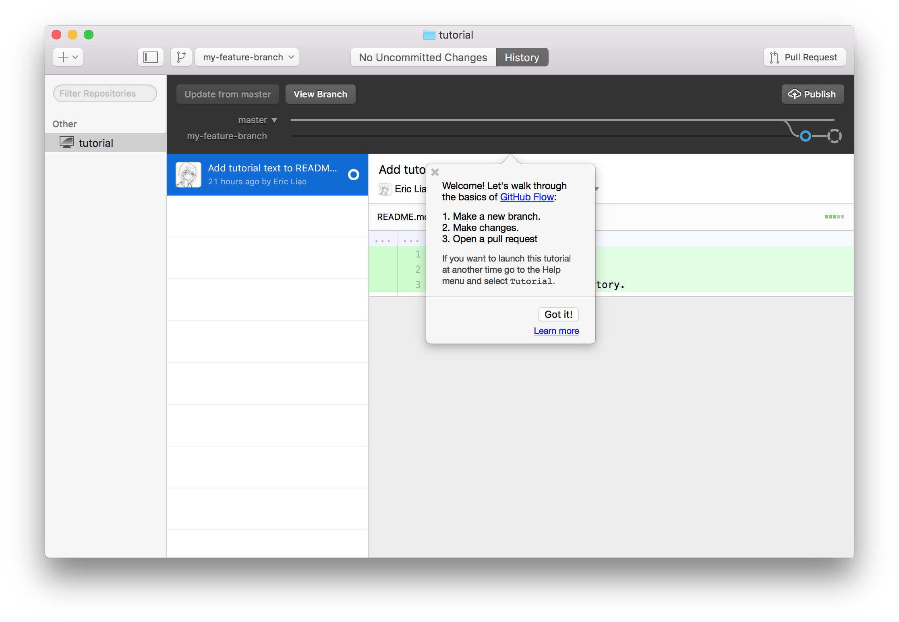
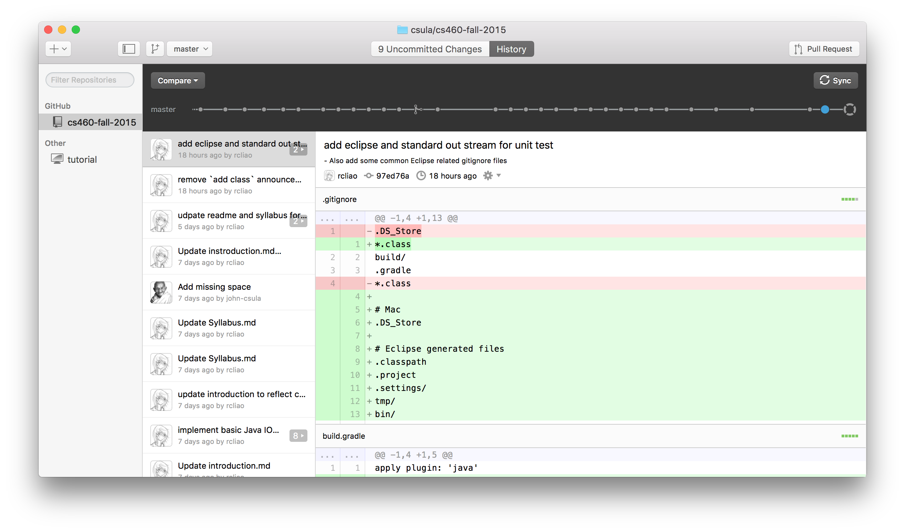

# Git/Github Tutorial

## Introduction from Eric

Hi there,

Due to various requests/confusions on how to use Git/Github, I'd like to take this chance to explain what is Git/Github both **conceptually** and **practically**.

> Please note that a knowledge of version control is very important for your career as Software Developer although this class will not use Git/Github to measure how much you understand the class.

With that being said, this article will first explains a few basic terminologies for Git like `branch`, `commit`, `push`, `Pull Request`, and `fetch` with `pull` with what they are visually. Then, we will go into basic *Hello World* example just like our first exercise.

The goal of this tutorial is to give all students abilities and confidence to use Git/Github just like all other tools (e.g. email and chat room) to increase **collaboration** of this class.

Without further due, lets get started.

## Objectives

* Understanding of Git/Github terminologies
* Knowing how to branch out and use branch
* Knowing how to add and commit file(s)
* Knowing how to push commits to Github repository
* Knowing how to create Pull Request

## Metrics

As this document is under misc folder, you will not be measured by your ability of using Git/Github.

## Git/Github terminologies

Reference: [Github Flow from Github guidelines][1]

As the reference document above uses more general approach to explain what is Github flow, I'm going to use terms that is very specific to us (like assignment to feature) to explain what each terminology is.

**branch**

Branches are like your personal workspace for a assignment. That is, each assignment should be on its own branch. And as assignment is completed, you should create a *Pull Request* to submit your assignment to me.

**Pull Request**

In our classroom set up, pull requests are the same as assignment submission. This will allow me(project collaborator) to start discussion with you on your changes (your assignment). I'll comment in-line with the specific line if I see anything wrong or I see anything that is worth praise. In short, it opens up the collaboration between you and me.

**commit**

You can think of a commit as a change in time. In theory, you can have only one commit for the entire assignment and then create pull request. It's not wrong, but you lose a lot of benefit of version control (e.g. able to revert back to specific point in time for the assignment).

**push**

Think about it like **upload to server**. Push will take all your commits and push it to `origin`(Github server at this case).

**fetch && pull**

It's like **download** but two steps.

Fetch is to update the local branch pointers to have latest changes without overriding what you are doing.

Pull is to download changes to what your current branch is on.

This two terms are very easy to confuse you with one and the other.

## Hello World example using Github Desktop

First of all, before the tutorial starts, you will need to download [Github Desktop][2] since this tutorial will be using Github Desktop as primary source control tool.

Upon the completion of download, please follow through the tutorial in Github Desktop as below:



After you run through the tutorial from Github, you will have some basic understanding of `branch`, `commit`, and `Pull Request` with `sync/publish`.

The only new terminology is `sync`. Sync is basically combining `pull` and `push` to sync your local repository with remote repository.

## Using Github Desktop with our repository

> Okay, I get the concept of `branch`, `commit` and `sync` now. How do I use Github Desktop with our class repository? Furthermore, how do I use this tool to help me to reduce **the pain** of using Git/Github?

It's easy. You will need to first clone our class repository ... https://github.com/csula/cs460-fall-2015 by below


After clone, you will see the repository showing up as repository below in your Github Desktop:



One thing you will need to configure after clone is to configure the remote path to your own repository rather than the class repository. You may configure it using the following after opening git shell:

```
git remote set-url origin `your repository path here`
```

Or go under repository setting, change remote url to be your own repository url.

With the remote url is set, you are ready to commit and push code! :+1:

[1]: https://guides.github.com/introduction/flow/
[2]:https://desktop.github.com/
